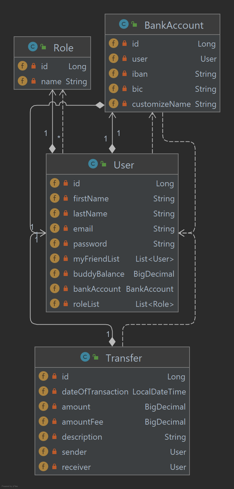
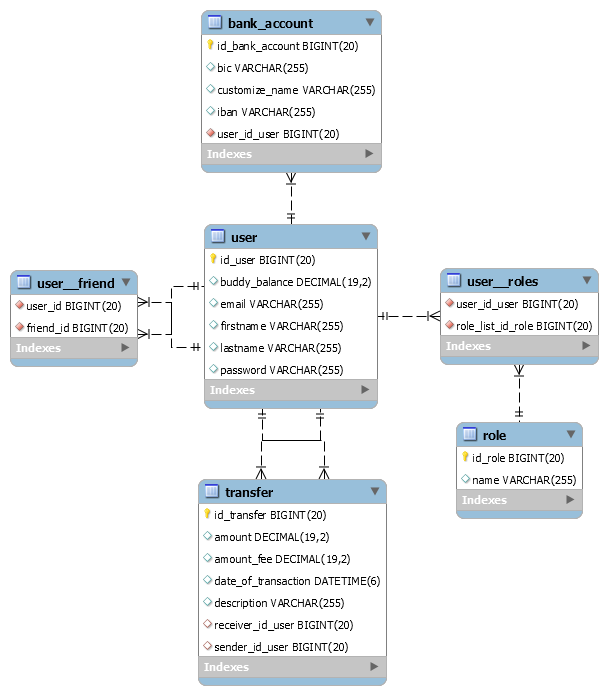

#Pay My Buddy
PayMyBuddy is a local and secure web application that allows users to easily exchange money with each other and with their own bank accounts.

##Prerequisites :
To install PayMyBuddy, you will need:
- an IDE
- java 11
- Maven 3
- MySQL 8,0
- a web Browser

##Running App :
After installing all the required softwares you need to create a Database with tables and data.
For this, please run the sql commands present in the file `src/main/resources/Data.sql`.

For more security, the database credentials must be externalized.
a folder containing the project is accessible at `/BuddyRun`.

move the project where you want it and open terminal in this folder.
you can run the application with this command :

`` java -jar <Nom du jar> ``.

To access the application, open your browser, go to `http://localhost:8080`.

##Documentation :
###Class Diagram:

###Physical Data Model:

